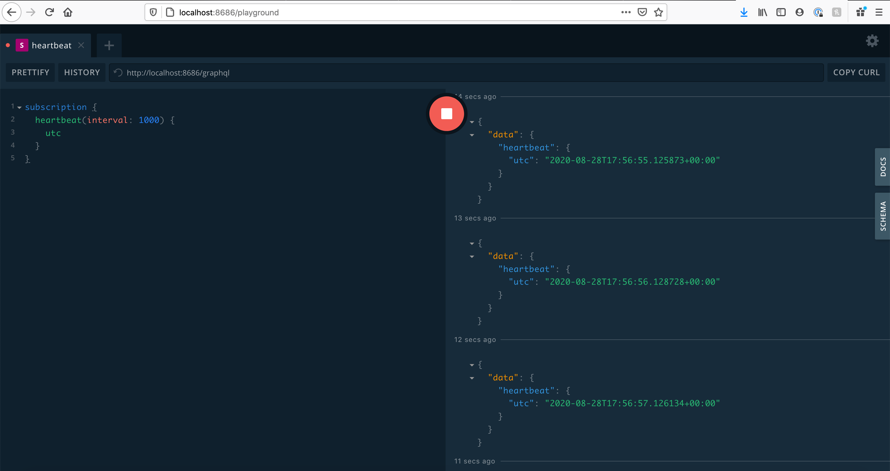

# RFC 3645 - 2020-08-31 - GraphQL API

This RFC proposes using [GraphQL](https://graphql.org/) for the Vector observability API.

## Scope

* Exposing a public API on port 8686, that can be connected to via API clients.
* Client requirements / considerations.
* Libraries and tooling.
* Merits and disadvantages of GraphQL vs. REST and gRPC.

## Motivation

### Observability

The Vector team is working on an observability dashboard that will enable users to:

- View Vector topology
- Validate `vector.toml` configuration
- Check the health and metrics that govern individual sources, transforms and sinks
- Provide deep insight into Vector I/O.

The protocol used for communication between Vector, and a connecting client is required to deliver data that is:

- High fidelity (captures all metrics)
- High volume (to multiple connecting clients)
- Real-time (sent with minimal delay between Vector raising an event, and its delivery)
- Efficient to parse/consume (the client shouldn't require heavy computation against a payload)
- Semantically meaningful (to translate it to visual charts and dashboards)

### Initial Clients

The initial proposal is to provide observability via two clients:

1. `vector top` / `vector tap` CLI commands.
2. A real-time web UI

### Protocol

This section summarizes various communications protocols, and their disadvantages for Vector observability:

**REST:**

- It's not suited for streaming data.
- It requires polling and/or long-lived connections.
- Data will initially be read-only; many HTTP verbs don't apply to us.
- The API interface isn't typed by default, making it cumbersome to work on the front-end without additional tooling.

**gRPC:**

- The full gRPC spec is incompatible with current browsers (see [this article](https://grpc.io/blog/state-of-grpc-web/) for a useful summary.)
- gRPC-Web offers a subset of gRPC features, including a lack of two-way messaging.
- The TLS story is harder to solve.
- gRPC-Web support is currently lacking in Rust. There's an [open issue on tower-grpc](https://github.com/tower-rs/tower-grpc/issues/35) to track.
- Enabling gRPC-Web therefore presently requires a middle-tier proxy, such as [Envoy](https://www.envoyproxy.io/), to transform requests to the gRPC-Web spec.

**WebSockets:**

- Asynchronous data payloads that are suited to streaming data, but harder to reconcile for single requests.
- Related: The need to match up a 'request ID' with a 'response ID', to determine which payload belongs to a given request.
- Long-lived connections that require explicit (re)connection logic.
- Not intrinsically type-safe for the client to consume; high degree of runtime validation.
- Non-trivial for non-web clients to interact with; not a common protocol outside of the web.

## Internal Proposal

I propose using GraphQL for API communications.

Advantages:

- A known spec with 5 years of history.
- Type safe.
- Dual HTTP + WebSockets model suits one-time and streaming queries.
- Production use at companies with heavy API workloads. Article refs: [Github](https://github.blog/2016-09-14-the-github-graphql-api/), [Facebook](https://www.apollographql.com/blog/graphql-at-facebook-by-dan-schafer-38d65ef075af/), [Shopify](https://shopify.dev/concepts/graphql), [Intuit](https://medium.com/intuit-engineering/graphql-intuits-path-to-one-api-system-b8495e4dd281), [Airbnb](https://medium.com/airbnb-engineering/how-airbnb-is-moving-10x-faster-at-scale-with-graphql-and-apollo-aa4ec92d69e2), [Trello / Atlassian](https://www.atlassian.com/engineering/a-look-at-trello-adopting-graphql-and-apollo-in-a-legacy-application).
- Rich ecosystem of tooling, for server/clients.
- Trivial debugging story.
- No proxy/middle-tier required.
- Works over plain HTTP.
- Optional TLS.
- No need to maintain separate schema. An 'introspection' query against a running Vector instance from the client provides a current view of type-safe schema.
- Trivial to document.
- Experience among the Vector / Timber team spanning over a year working with Alloy, covering full-stack schema design and front-end client tooling.
- I've been personally involved in GraphQL projects since 2015.

### Tooling

- [async-graphql](https://github.com/async-graphql/async-graphql) (Vector). I initially tried Juniper, but subscriptions (i.e. real-time data) is still WIP and several key elements of the GraphQL spec (such as interfaces) are TBD. Source: [Feature comparison](https://github.com/async-graphql/async-graphql/blob/master/feature-comparison.md).

- [urql](https://formidable.com/open-source/urql/) (UI). We used the [React Apollo client](https://github.com/apollographql/apollo-client) in Alloy, which was mostly positive. We did run into some issues where data that lacks an `id` field would return `null`. Urql has a simpler caching story and may side-step these issues. Both clients use React hooks, which matches our [vector-ui](https://github.com/timberio/vector-ui) tooling.

- [GraphQL Code Generator](https://graphql-code-generator.com/) (UI). We used this in Alloy to generate Typescript types and React hooks. It offers an [urql plugin](https://graphql-code-generator.com/docs/plugins/typescript-urql) and builds type-safe/declarative React hooks which overlay urql to re-render the host React component with data and loading state.

### Proof-of-Concept

I started work in #3514 to test [async-graphql](https://github.com/async-graphql/async-graphql), and expose internal metrics.

A playground is available in #3514 to test queries, including `subscription` queries:



The GraphQL SDL is:

```gql

```

## Doc-level Proposal

- Optional. Only do this if your change is public facing.
- Demonstrate how your change will look in the form of Vector's public docs.

## Rationale

- Why is this change worth it?
- What is the impact of not doing this?
- How does this position us for success in the future?

## Prior Art

- List prior art, the good and bad.
- Why can't we simply use or copy them?

## Drawbacks

- Why should we not do this?
- What kind on ongoing burden does this place on the team?

## Alternatives

- What other approaches have been considered and why did you not choose them?
- How about not doing this at all?

## Outstanding Questions

- List any remaining questions that you have.
- These must be resolved before the RFC can be merged.

## Plan Of Attack

Incremental steps that execute this change. Generally this is in the form of:

- [ ] Submit a PR with spike-level code _roughly_ demonstrating the change.
- [ ] Incremental change #1
- [ ] Incremental change #2
- [ ] ...

Note: This can be filled out during the review process.
